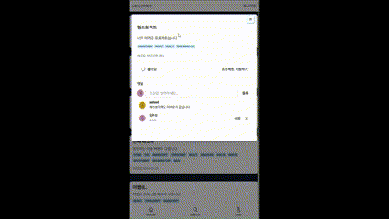
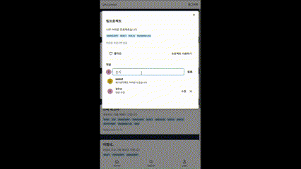
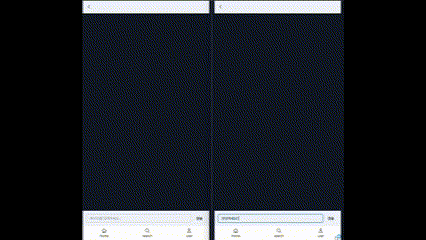

# 🌉 DevConnect

## 목차
1. [👋 서비스 소개](#-서비스-소개)
2. [🛠 Tech Stack](#-tech-stack)
3. [ERD](#erd)
4. [🛠 Troubleshooting](#-troubleshooting)
5. [프로젝트 시작](#프로젝트-시작)

---

## 👋 서비스 소개

프로젝트를 하고싶은데 사람이 부족하신가요!  
프로젝트를 위해 사람을 구해보세요!  
**주요 기능**:

1. **로그인/회원가입**  
   구글과 카카오를 활용한 소셜 로그인으로 간편하게 로그인 가능합니다.
2. **프로젝트 구인**  
   게시글 작성으로 프로젝트 인원을 구해보세요!
3. **피드**  
   최신순으로 정렬하여 볼 수 있고 좋아요를 눌러 나중에 모아볼수있습니다!.  
    
3. **댓글**  
   피드에 댓글을 달아 소통할수있습니다 !.  
   
4. **검색하기**  
   해시태그 및 유저 이름 자동완성 기능을 이용하여 검색할 수 있습니다.
5. **채팅페이지**  
   채팅을 할 수 있으며 신청자와 조율할 수 있습니다.
   
---

## 🛠 Tech Stack


---

## ERD


---

## 🛠 Troubleshooting

---

## 프로젝트 시작

```bash
pnpm dev
